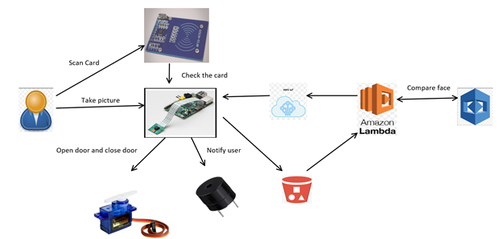
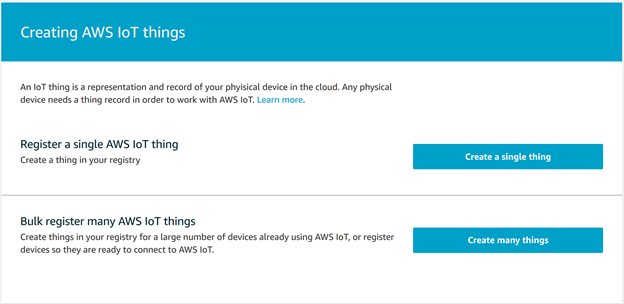
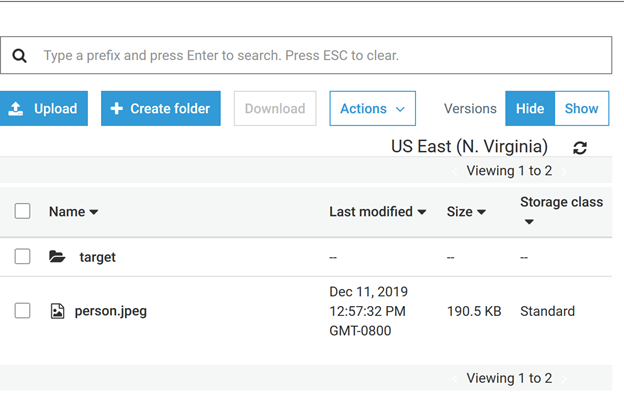
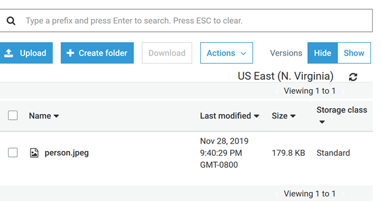
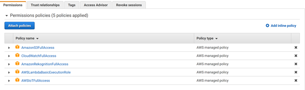
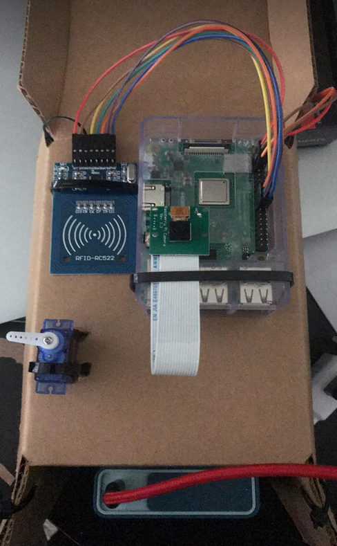

<h1>SmartDoor Project</h1> 

<strong>Introduction:</strong> There are many smart door system or smart lock on the market, and the price are very high from a hundred to thousand a door lock. Thus, it comes to an idea making a smart door system for myself.

<strong>Idea:</strong> For this project, the idea is using the services of AWS for Raspberry Pi 3. When a person scan RFID card, it will check the card is correct or not. If the card is correct, the system start to take a picture of the person and compare their face with their face is store in AWS bucket. If the face is the same, the door opens for 10 second and close after that.

 <!-- Block parent element -->
      
      
Figure 1. Diagram of flow in the project

<strong>Tools:</strong>
	
	<ul>
		<li>Raspberrypi 3 with camera module and Raspbian OS</li>
		<li>RFID card</li>
		<li>Servo motor</li>
		<li>Active buzzer</li>
		<li>AWS Iot Core</li>
		<li>AWS S3</li>
		<li>AWS Lambda</li>
		<li>AWS Rekognition</li>
	</ul>

<strong>Procedure:</strong>

	
	First of all, we must write to a RFID card for a specific user and check out writeRFID.py to write on the card. To test the RFID card, you should check out read.py. For the connection the RFID to raspberry pi follow these pins :

	

SDA <–> 24

SCK <–> 23

MOSI <–> 19

MISO <–> 21

IRQ <–> 18

GND <–> 6

RST <–> 22

3.3V <–> 1

	

In the raspberry pi CLI, we type the following commands:

	

	
<i>sudo raspi-config</i>

Then we enable the SPI, camera module, SSH. After that, we restart the Raspberry pi:

	

<i>sudo reboot</i>

	Then we run the two previous source code to write and read on RFID.
For the servo, we connect to pin 7 for its output, pin 2 for its DC power, and pin 6 to the ground. For the active buzzer, we connect to pin 3, pin 6 to the ground. First thing to set up AWS IoT core, we must register a thing in AWS

	After checking RIFD card and hardware connection finish, we move on to generate AWS cloud to compare user face with face that is stored in S3. AWS Lambda will be trigger  Rekognition whenever the captured image is sent to S3.

	
	
Figure 2. Register a thing in AWS

By following this document from AWS, we are able to set up AWS IoT core: 

<a href="https://docs.aws.amazon.com/iot/latest/developerguide/sdk-tutorials.html#iot-sdk-create-thing">Developer Guide AWS</a>

Next step is creating a bucket S3 by following this document:

	<a href="https://docs.aws.amazon.com/quickstarts/latest/s3backup/step-1-create-bucket.html">How to create bucket S3</a>

In that bucket, we make a file name “target”. In that file, we store face that need to compare. In figure 3 and figure 4, the target folder is generated and the person image inside that folder.

	
	
Figure 3. The target folder inside the bucket

	
	
Figure 4. The target image inside the target folder

Last step is setting up AWS Lambda, but we need to configure IAM role for the AWS lambda to trigger when it is received a image from S3. By following this document:

<a href="https://docs.aws.amazon.com/IAM/latest/UserGuide/id_roles.html">IAM role setup</a>

we are able to generate IAM role. The role should have following policies in figure 5.

	
	
Figure 5. The policies for the IAM role

	
In AWS Lambda, we are following the document and create AWS lambda successful:

	<a href="https://docs.aws.amazon.com/lambda/latest/dg/getting-started.html">Lambda Tutorial</a>

	
In AWS Lambda, we use python as the main language. The source code for AWS Lambda is:

	<xmp>
from __future__ import print_function
import boto3
from decimal import Decimal
import json
import urllib

print('Loading function')

rekognition = boto3.client('rekognition')
iot = boto3.client('iot-data')

# --------------- Helper Functions to call Rekognition APIs ------------------

def compare_faces(bucket, key, key_target, threshold=80):
	response = rekognition.compare_faces(
	    SourceImage={
			"S3Object": {
				"Bucket": bucket,
				"Name": key,
			}
		},
		TargetImage={
			"S3Object": {
				"Bucket": bucket,
				"Name": key_target,
			}
		},
	    SimilarityThreshold=threshold,
	)
	return response['SourceImageFace'], response['FaceMatches']
# --------------- Main handler ------------------
def lambda_handler(event, context):
    print("Received event: " + json.dumps(event, indent=2))
    bucket = event['Records'][0]['s3']['bucket']['name']
    key = urllib.unquote_plus(event['Records'][0]['s3']['object']['key'].encode('utf8'))
    key_target = "target/" + key
    try:
        response = compare_faces(bucket, key, key_target)
        print(response)
        mypayload = json.dumps(response)
        iotResponse = iot.publish(
            topic="", //Fill in this
            qos=1,
            payload=mypayload)
        print(iotResponse)
        return iotResponse
    except Exception as e:
        print(e)
        print("Error processing object {} from bucket {}. ".format(key, bucket) +
              "Make sure your object and bucket exist and your bucket is in the same region as this function.")
        raise e
After we implement the code, we try to test it with this test event:
{
  "Records": [
    {
      "eventVersion": "2.0",
      "eventSource": "aws:s3",
      "awsRegion": "us-east-1",
      "eventTime": "1970-01-01T00:00:00.000Z",
      "eventName": "ObjectCreated:Put",
      "userIdentity": {
        "principalId": "EXAMPLE"
      },
      "requestParameters": {
        "sourceIPAddress": "" //Fill in this
      },
      "responseElements": {
        "x-amz-request-id": "EXAMPLE123456789",
        "x-amz-id-2": "" //Fill in this
      },
      "s3": {
        "s3SchemaVersion": "1.0",
        "configurationId": "testConfigRule",
        "bucket": {
          "name": "",//Fill in this
          "ownerIdentity": {
            "principalId": "EXAMPLE"
          },
          "arn": "arn:aws:s3:::" //Fill in this
        },
        "object": {
          "key": "person.jpeg",
          "size": 1024,
          "eTag": "",//Fill in this
          "sequencer": "0A1B2C3D4E5F678901"
        }
      }
    }
  ]
}
</xmp>

It works fine for us. As everything are setting up, we have our final product in figure 6.

	
	
Figure 6. The complete Smart Door System

<strong>Conclusion:</strong>

The project is finished successful with one-person team. The project can be improved more in the future by using solenoid lock instead of servo motor. Besides, the camera can become a security camera. In fact, whenever a stranger comes in front of the door, an app will notify user there is a stranger in front of their house and they can decide to open the door or not.

<strong>Video Demo:</strong>

<a href="https://youtu.be/VLktmlqoqMo">https://youtu.be/VLktmlqoqMo</a>
	
	
	
	
